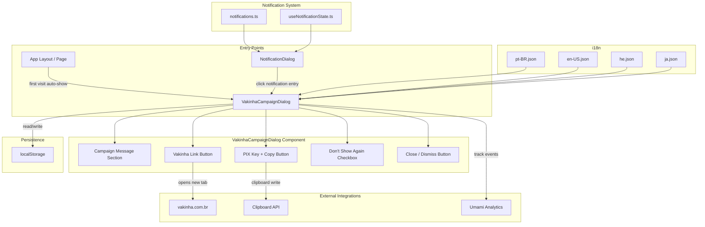
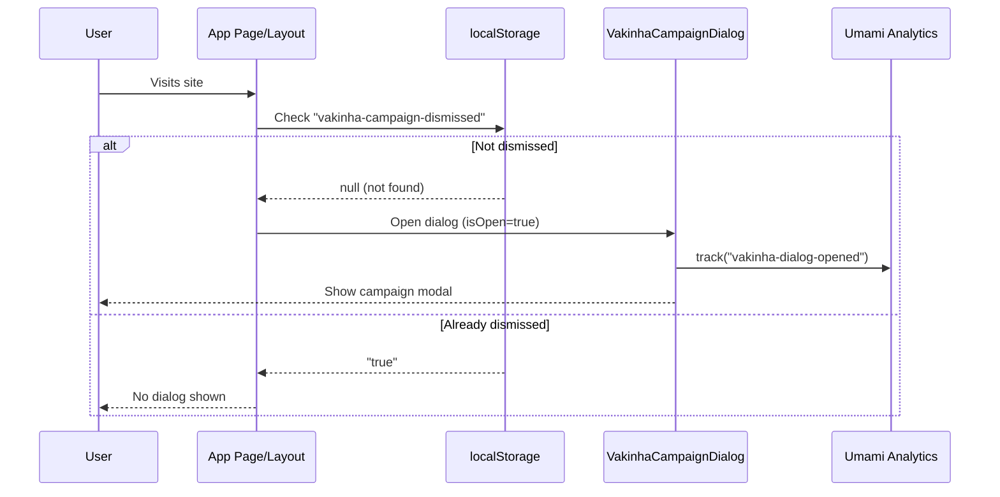
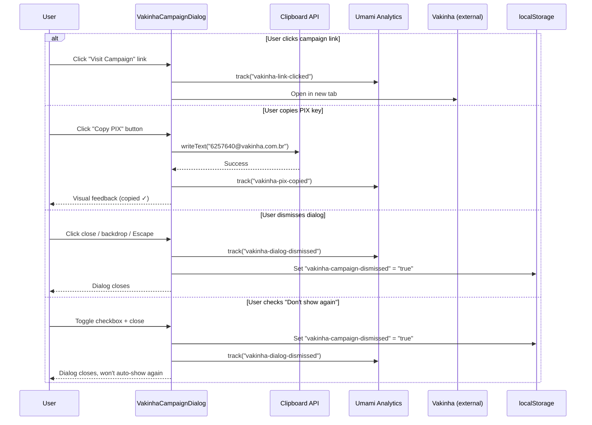
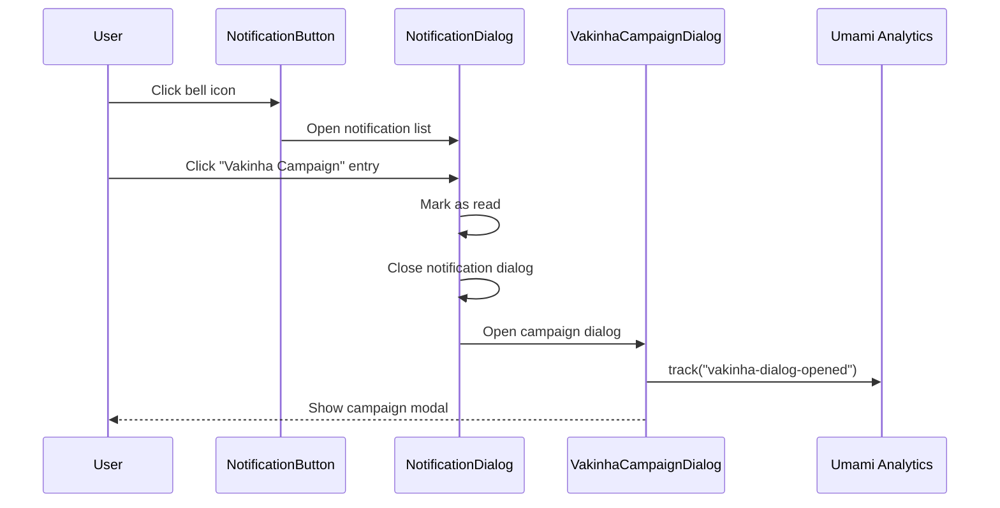

# Design Document: Vakinha Campaign Dialog

## Overview

This feature introduces a visually striking, full-screen modal dialog ("Comunicado") that promotes the Interactive Kabbalah Vakinha crowdfunding campaign. Unlike the existing small `DonationPanel` popover, this is a proper attention-grabbing announcement modal with mystical/kabbalah-themed design (amber/gold gradients, subtle animations, particle-like effects on a dark backdrop).

The feature has three pillars: (1) the campaign dialog component itself with auto-show-on-first-visit logic and "Don't show again" persistence, (2) a notification bell entry that re-opens the dialog on demand, and (3) Umami analytics tracking for all user interactions with the dialog.

The dialog integrates with the existing custom modal pattern (focus trap, Escape key, backdrop click, aria-modal), the notification system (`src/data/notifications.ts`), the i18n system (4 locales), and the globally-loaded Umami analytics script.

## Architecture



## Sequence Diagrams

### Auto-Show on First Visit



### User Interactions Within Dialog



### Notification Bell Re-open Flow



## Components and Interfaces

### Component 1: VakinhaCampaignDialog

**Purpose**: Full-screen modal dialog that presents the Vakinha crowdfunding campaign with a mystical, premium visual design. Handles all user interactions (link click, PIX copy, dismiss) and Umami tracking.

**Interface**:
```typescript
interface VakinhaCampaignDialogProps {
  isOpen: boolean;
  onClose: () => void;
}
```

**Responsibilities**:
- Render a visually striking modal with kabbalah-themed design (amber/gold gradients, dark backdrop, subtle glow effects)
- Display campaign motivational message (translated via next-intl)
- Render Vakinha campaign link (opens in new tab with `rel="noopener noreferrer"`)
- Render PIX key with copy-to-clipboard button and visual feedback
- Implement full accessibility: focus trap, Escape key close, backdrop click close, aria-modal, aria-labelledby
- Track all user interactions via Umami (`window.umami?.track()`)
- Responsive layout (mobile-first, adapts to desktop)
- Handle "Don't show again" checkbox logic

### Component 2: useVakinhaCampaign (Custom Hook)

**Purpose**: Manages the auto-show-on-first-visit logic and localStorage persistence for the campaign dialog dismissal state.

**Interface**:
```typescript
interface UseVakinhaCampaignReturn {
  shouldShowDialog: boolean;
  isDialogOpen: boolean;
  openDialog: () => void;
  closeDialog: (dontShowAgain?: boolean) => void;
}

function useVakinhaCampaign(): UseVakinhaCampaignReturn;
```

**Responsibilities**:
- Read localStorage on mount to determine if campaign was previously dismissed
- Expose `shouldShowDialog` for auto-show logic (only on first visit)
- Provide `openDialog` for manual trigger (from notification click)
- Provide `closeDialog` with optional `dontShowAgain` parameter to persist dismissal
- Gracefully handle localStorage unavailability (default to not showing, never crash)

### Component 3: Notification Entry (Data)

**Purpose**: A new entry in `src/data/notifications.ts` that represents the Vakinha campaign notification.

**Interface**:
```typescript
// New entry added to the notifications array
const vakinhaNotification: NotificationEntry = {
  id: 'vakinha-campaign-v1',
  publishedAt: '2025-01-15T00:00:00Z',
  titleKey: 'notifications.vakinha_campaign.title',
  descriptionKey: 'notifications.vakinha_campaign.description',
};
```

**Responsibilities**:
- Appear in the notification list with proper title/description
- When clicked, trigger the Vakinha campaign dialog to open
- Follow existing notification system conventions (markAsRead, i18n keys)

## Data Models

### Campaign Constants

```typescript
const VAKINHA_CAMPAIGN = {
  url: 'https://www.vakinha.com.br/vaquinha/interactive-kabbalah-redesign-e-plataformizacao',
  pixKey: '6257640@vakinha.com.br',
} as const;
```

### localStorage Keys

```typescript
const STORAGE_KEY_DISMISSED = 'vakinha-campaign-dismissed'; // value: "true" | absent
```

### Umami Event Names

```typescript
type VakinhaEvent =
  | 'vakinha-dialog-opened'
  | 'vakinha-pix-copied'
  | 'vakinha-link-clicked'
  | 'vakinha-dialog-dismissed';
```

### Translation Keys (i18n)

```typescript
// Namespace: "vakinhaCampaign" (new top-level namespace)
interface VakinhaCampaignTranslations {
  title: string;              // Dialog heading
  subtitle: string;           // Subtitle / tagline
  message: string;            // Main motivational message body
  linkButton: string;         // CTA button text for campaign link
  pixLabel: string;           // Label above PIX key
  pixCopied: string;          // Feedback text after copy
  dontShowAgain: string;      // Checkbox label
  close: string;              // Close button aria-label (or use ui.close)
}

// Namespace: "notifications" (add to existing)
interface VakinhaNotificationTranslations {
  vakinha_campaign: {
    title: string;            // Notification list title
    description: string;      // Notification list description
  };
}
```

**Validation Rules**:
- All 4 locale files must have the `vakinhaCampaign` namespace with all keys
- All 4 locale files must have `notifications.vakinha_campaign.title` and `.description`
- No translation key may be empty
- Campaign URL and PIX key are constants (never translated)

## Algorithmic Pseudocode

### Auto-Show Logic (useVakinhaCampaign Hook)

```typescript
// Runs on client-side mount only
function useVakinhaCampaign(): UseVakinhaCampaignReturn {
  const [isDialogOpen, setIsDialogOpen] = useState(false);
  const [hasCheckedStorage, setHasCheckedStorage] = useState(false);

  // STEP 1: On mount, check localStorage
  useEffect(() => {
    const dismissed = safeGetItem(STORAGE_KEY_DISMISSED);
    if (dismissed !== 'true') {
      // First visit — auto-show dialog
      setIsDialogOpen(true);
    }
    setHasCheckedStorage(true);
  }, []);

  // STEP 2: Open dialog manually (from notification click)
  const openDialog = useCallback(() => {
    setIsDialogOpen(true);
  }, []);

  // STEP 3: Close dialog with optional "don't show again"
  const closeDialog = useCallback((dontShowAgain?: boolean) => {
    setIsDialogOpen(false);
    // Always persist dismissal (closing = dismissed)
    safeSetItem(STORAGE_KEY_DISMISSED, 'true');
  }, []);

  return {
    shouldShowDialog: hasCheckedStorage && isDialogOpen,
    isDialogOpen,
    openDialog,
    closeDialog,
  };
}
```

**Preconditions:**
- Component is rendered in a client-side context (`'use client'`)
- `safeGetItem` and `safeSetItem` are available (from existing useNotificationState.ts)

**Postconditions:**
- If localStorage has `vakinha-campaign-dismissed === "true"`, dialog never auto-shows
- If localStorage is empty/unavailable, dialog auto-shows on mount
- After `closeDialog()`, localStorage is updated and dialog is hidden
- `openDialog()` always shows the dialog regardless of localStorage state

**Loop Invariants:** N/A

### Dialog Render with Accessibility

```typescript
function VakinhaCampaignDialog({ isOpen, onClose }: VakinhaCampaignDialogProps) {
  const dialogRef = useRef<HTMLDivElement>(null);
  const previousFocusRef = useRef<HTMLElement | null>(null);
  const t = useTranslations('vakinhaCampaign');

  // STEP 1: Focus management
  useEffect(() => {
    if (!isOpen) return;
    previousFocusRef.current = document.activeElement as HTMLElement;
    setTimeout(() => dialogRef.current?.focus(), 0);
    return () => { previousFocusRef.current?.focus(); };
  }, [isOpen]);

  // STEP 2: Keyboard handling (Escape + Tab trap)
  useEffect(() => {
    if (!isOpen) return;
    const handleKeyDown = (e: KeyboardEvent) => {
      if (e.key === 'Escape') { onClose(); return; }
      if (e.key === 'Tab') { /* focus trap logic */ }
    };
    document.addEventListener('keydown', handleKeyDown);
    return () => document.removeEventListener('keydown', handleKeyDown);
  }, [isOpen, onClose]);

  // STEP 3: Track open event
  useEffect(() => {
    if (isOpen) {
      window.umami?.track('vakinha-dialog-opened');
    }
  }, [isOpen]);

  // STEP 4: Handle interactions
  const handleLinkClick = () => {
    window.umami?.track('vakinha-link-clicked');
  };

  const handleCopyPix = async () => {
    try {
      await navigator.clipboard.writeText(VAKINHA_CAMPAIGN.pixKey);
      window.umami?.track('vakinha-pix-copied');
      // Set copied state for visual feedback
    } catch {
      // Fallback: show selectable input
    }
  };

  const handleDismiss = () => {
    window.umami?.track('vakinha-dialog-dismissed');
    onClose();
  };

  if (!isOpen) return null;

  // Render: fixed overlay > backdrop > dialog panel
  return (/* JSX */);
}
```

**Preconditions:**
- `isOpen` is a boolean
- `onClose` is a callable function
- Component is within `next-intl` provider (translations available)
- Umami script is loaded globally (`window.umami` may be undefined — always use optional chaining)

**Postconditions:**
- When `isOpen=true`: renders fixed overlay with modal, traps focus, body scroll locked
- When `isOpen=false`: renders nothing, returns focus to trigger element
- All interactions dispatch Umami tracking events
- Campaign link opens in new tab with security attributes
- PIX copy provides visual feedback or fallback input

**Loop Invariants:** N/A (focus trap iteration: all focusable elements within dialog remain consistent during dialog lifetime)

### Notification Click Handler

```typescript
// In Navbar or wherever NotificationDialog is managed
const handleNotificationClick = (id: string) => {
  markAsRead(id);
  if (id === 'vakinha-campaign-v1') {
    setIsNotificationDialogOpen(false);
    vakinhaCampaign.openDialog();
  }
};
```

**Preconditions:**
- `id` matches a valid notification entry
- `markAsRead` and `openDialog` functions are available in scope

**Postconditions:**
- Notification is marked as read in localStorage
- If the clicked notification is the vakinha campaign, the notification list closes and the campaign dialog opens
- For other notifications, default behavior is preserved

## Key Functions with Formal Specifications

### Function 1: trackVakinhaEvent()

```typescript
function trackVakinhaEvent(event: VakinhaEvent, data?: Record<string, string>): void {
  window.umami?.track(event, data);
}
```

**Preconditions:**
- `event` is one of the valid VakinhaEvent string literals
- `window.umami` may be undefined (script may not have loaded yet)

**Postconditions:**
- If Umami is available: event is dispatched to Umami servers
- If Umami is unavailable: no error thrown, function is a no-op
- Function never throws (safe optional chaining)

### Function 2: handleCopyPix()

```typescript
async function handleCopyPix(): Promise<void> {
  try {
    if (!navigator.clipboard) throw new Error('Clipboard unavailable');
    await navigator.clipboard.writeText(VAKINHA_CAMPAIGN.pixKey);
    setCopied(true);
    trackVakinhaEvent('vakinha-pix-copied');
    setTimeout(() => setCopied(false), 2500);
  } catch {
    setClipboardUnavailable(true);
  }
}
```

**Preconditions:**
- Function is called within a user gesture context (required for clipboard access in some browsers)
- `VAKINHA_CAMPAIGN.pixKey` is the constant `"6257640@vakinha.com.br"`

**Postconditions:**
- Success path: clipboard contains PIX key, `copied` state is true for 2.5s, Umami event tracked
- Failure path: `clipboardUnavailable` state is true, a selectable input fallback is shown
- Never throws to the caller

### Function 3: safeGetItem / safeSetItem (Existing)

```typescript
function safeGetItem(key: string): string | null;
function safeSetItem(key: string, value: string): void;
```

**Preconditions:**
- `key` is a non-empty string

**Postconditions:**
- `safeGetItem`: returns stored value or null (never throws)
- `safeSetItem`: persists value or silently fails (never throws)
- App continues functioning even if localStorage is completely unavailable

## Example Usage

```typescript
// --- In a page or layout component ---
'use client';

import VakinhaCampaignDialog from '@/components/Notifications/VakinhaCampaignDialog';
import { useVakinhaCampaign } from '@/hooks/useVakinhaCampaign';

export default function PageWithCampaign() {
  const { isDialogOpen, closeDialog, openDialog } = useVakinhaCampaign();

  return (
    <>
      {/* ... page content ... */}
      <VakinhaCampaignDialog
        isOpen={isDialogOpen}
        onClose={() => closeDialog()}
      />
    </>
  );
}

// --- In Navbar (notification click handler) ---
const handleNotificationAction = (id: string) => {
  markAsRead(id);
  if (id === 'vakinha-campaign-v1') {
    setIsNotificationDialogOpen(false);
    openVakinhaCampaignDialog(); // from useVakinhaCampaign hook
  }
};

// --- Notification data entry ---
// src/data/notifications.ts
export const notifications: NotificationEntry[] = [
  {
    id: 'vakinha-campaign-v1',
    publishedAt: '2025-01-15T00:00:00Z',
    titleKey: 'notifications.vakinha_campaign.title',
    descriptionKey: 'notifications.vakinha_campaign.description',
  },
  // ... existing entries ...
];
```

## Correctness Properties

*A property is a characteristic or behavior that should hold true across all valid executions of a system — essentially, a formal statement about what the system should do. Properties serve as the bridge between human-readable specifications and machine-verifiable correctness guarantees.*

### Property 1: Dialog Visibility Determinism

*For any* user session, the Campaign_Hook auto-shows the dialog if and only if `localStorage.getItem('vakinha-campaign-dismissed')` is NOT `"true"` at the time of page mount. Once dismissed (by any means), the dialog SHALL NOT auto-show on subsequent visits.

**Validates: Requirements 1.1, 1.2**

### Property 2: Umami Event Coverage

*For any* user interaction with the campaign dialog (open, link click, PIX copy, dismiss), exactly one corresponding Umami tracking event SHALL be dispatched. The event name SHALL be one of: `vakinha-dialog-opened`, `vakinha-link-clicked`, `vakinha-pix-copied`, `vakinha-dialog-dismissed`. If `window.umami` is undefined, no error SHALL be thrown.

**Validates: Requirements 8.1, 8.2, 8.3, 8.4, 8.5**

### Property 3: Translation Completeness

*For any* supported locale (pt-BR, en-US, he, ja), all translation keys in the `vakinhaCampaign` namespace (title, subtitle, message, linkButton, pixLabel, pixCopied, dontShowAgain) and `notifications.vakinha_campaign` (title, description) SHALL be present and non-empty.

**Validates: Requirements 9.2, 9.3**

### Property 4: Constant Values Immutability

*For any* locale or application state, the rendered dialog SHALL always display the exact PIX key `"6257640@vakinha.com.br"` and the exact campaign URL `"https://www.vakinha.com.br/vaquinha/interactive-kabbalah-redesign-e-plataformizacao"`. These values are never derived from translations or user input.

**Validates: Requirements 9.4**

### Property 5: Focus Trap Invariant

*For any* state where the dialog `isOpen === true` and any sequence of Tab key presses, focus SHALL cycle only through focusable elements within the dialog and never escape to elements outside the dialog boundary.

**Validates: Requirements 6.1**

### Property 6: Graceful Degradation — localStorage

*For any* environment where localStorage is unavailable (private browsing, storage quota exceeded, disabled), the Campaign_Hook SHALL NOT throw errors. The dialog SHALL default to auto-showing on each visit and all interactions SHALL remain functional without persisting dismissal state.

**Validates: Requirements 10.1, 10.2**

### Property 7: Notification Opens Dialog Regardless of Dismissal

*For any* localStorage state (whether Dismissal_Flag is "true" or absent), when the user clicks the Vakinha campaign notification entry, the Campaign_Dialog SHALL open.

**Validates: Requirements 7.4**

### Property 8: All Close Methods Persist Dismissal

*For any* close method from the set {close button click, backdrop click, Escape key press}, closing the Campaign_Dialog SHALL set the Dismissal_Flag to "true" in localStorage and remove the dialog from the DOM.

**Validates: Requirements 5.1, 5.4**

### Property 9: Focus Restoration on Close

*For any* element that triggered the dialog opening, when the Campaign_Dialog closes, focus SHALL be restored to that triggering element.

**Validates: Requirements 6.4**

## Error Handling

### Error Scenario 1: Clipboard API Unavailable

**Condition**: `navigator.clipboard` is undefined (HTTP context, older browser, permissions denied)
**Response**: Set `clipboardUnavailable` state to `true`; render a read-only `<input>` with the PIX key that users can manually select and copy
**Recovery**: User can still copy manually; all other dialog functionality remains intact

### Error Scenario 2: localStorage Unavailable

**Condition**: `localStorage.getItem()` or `localStorage.setItem()` throws (private browsing, quota exceeded)
**Response**: `safeGetItem` returns `null` (dialog auto-shows); `safeSetItem` silently fails (dismissal not persisted)
**Recovery**: Dialog may auto-show on every visit, but never crashes the app. User can still interact normally.

### Error Scenario 3: Umami Script Not Loaded

**Condition**: `window.umami` is undefined (ad blocker, script load failure, development mode)
**Response**: `window.umami?.track()` evaluates to `undefined` — no error thrown
**Recovery**: Analytics silently disabled; all UI functionality remains unaffected

### Error Scenario 4: Translation Key Missing

**Condition**: A key in `vakinhaCampaign` namespace is missing from a locale file
**Response**: `next-intl` renders the raw key path as fallback text
**Recovery**: The dialog is still functional, just with un-translated text. Caught during development via linting.

### Error Scenario 5: Dialog Opened During SSR

**Condition**: Component renders on server where `document` and `window` are unavailable
**Response**: `useEffect` hooks only run client-side; `isOpen` starts as `false` until hydration; no SSR errors
**Recovery**: Dialog state hydrates correctly on client — no mismatch because initial state is always "closed"

## Testing Strategy

### Unit Testing Approach

**Component Tests (Vitest + Testing patterns)**:
- `VakinhaCampaignDialog` renders when `isOpen=true` and doesn't render when `isOpen=false`
- Close button invokes `onClose` callback
- Campaign link has correct `href`, `target="_blank"`, and `rel="noopener noreferrer"`
- PIX copy button calls `navigator.clipboard.writeText` with exact PIX key
- Escape key triggers close
- All required aria attributes are present

**Hook Tests (Vitest)**:
- `useVakinhaCampaign` reads localStorage on mount
- Returns `isDialogOpen=true` when storage is empty
- Returns `isDialogOpen=false` when storage has `"true"`
- `closeDialog()` sets localStorage and closes dialog
- `openDialog()` opens dialog regardless of storage state

### Property-Based Testing Approach

**Property Test Library**: fast-check (already in devDependencies)

**Properties to test**:
- For any sequence of open/close operations, the localStorage state is consistent with the last close call
- For any locale string from the supported set, the translation lookup never returns undefined
- For any combination of clipboard availability (true/false) and Umami availability (true/false), the dialog never throws

### Integration Testing Approach (Playwright)

- First-visit scenario: clear localStorage → load page → dialog appears
- Return-visit scenario: set dismissed flag → load page → dialog does NOT appear
- Notification flow: click bell → click Vakinha notification → campaign dialog opens
- PIX copy: click copy button → verify clipboard content (where supported)
- Link click: verify new tab opened with correct URL
- Responsive: verify dialog renders properly on mobile and desktop viewports
- Accessibility: verify focus trap, Escape key, screen reader announcement

## Performance Considerations

- Dialog component is lightweight (no heavy images or external resources)
- CSS animations use `transform` and `opacity` (GPU-accelerated, no layout thrashing)
- localStorage check is synchronous but wrapped in useEffect (non-blocking)
- Umami tracking is fire-and-forget (no await, no callback)
- Dialog is conditionally rendered (`if (!isOpen) return null`) — zero DOM overhead when hidden

## Security Considerations

- External link uses `rel="noopener noreferrer"` to prevent reverse tabnapping
- PIX key and URL are hardcoded constants — not derived from user input or URL params
- No user-generated content rendered in the dialog (XSS-safe)
- Umami tracking sends only event names (no PII, no session data)
- localStorage is same-origin isolated — no cross-site access risk

## Dependencies

- `next-intl` (existing) — Translation key resolution
- `react` / `next` (existing) — Component framework
- `tailwindcss` (existing) — Styling (gradients, animations, responsive)
- Umami script (existing, globally loaded) — Analytics tracking
- `fast-check` (existing devDependency) — Property-based testing
- **No new dependencies required**
