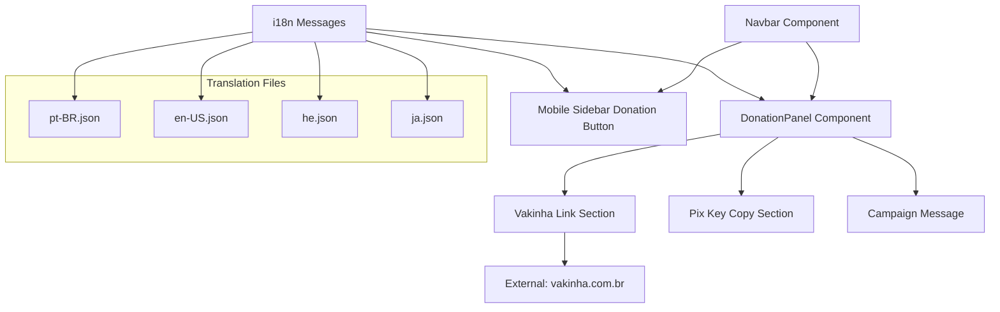
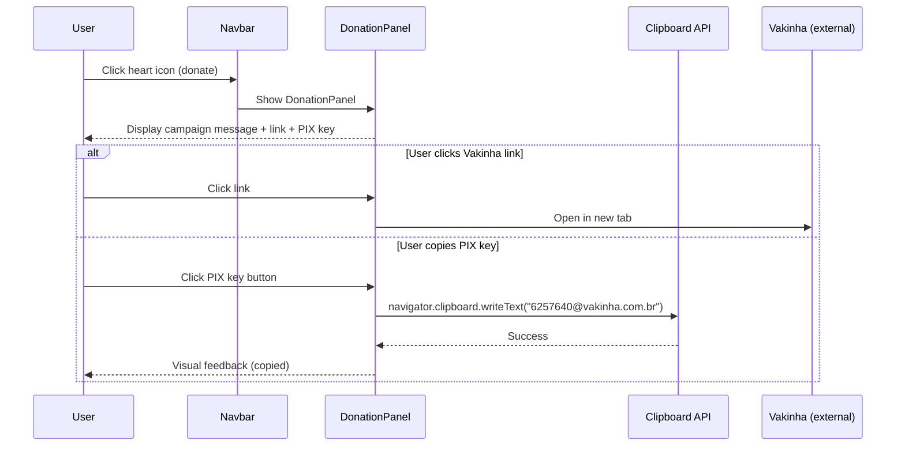
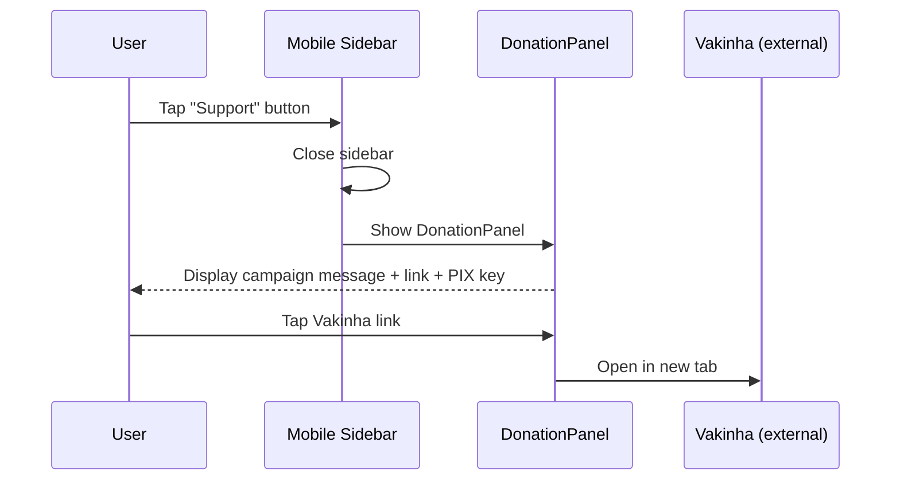

# Design Document: Vakinha Donation Link

## Overview

Esta feature substitui o mecanismo de doação via PIX pessoal (telefone 48991913318) por um link de crowdfunding da plataforma Vakinha. O objetivo é centralizar as doações para a "plataformização" da aplicação Interactive Kabbalah, direcionando os usuários para a vaquinha oficial com mensagem motivacional, link direto e chave PIX exclusiva da Vakinha.

A mudança afeta o componente `DonationPanel` no Navbar (desktop e mobile), os arquivos de tradução (i18n) em todos os idiomas suportados (pt-BR, en-US, he, ja), e o botão de doação na sidebar mobile. A experiência deve ser mais rica — com link clicável para a página da vakinha, exibição da chave PIX Vakinha para cópia, e mensagem contextualizada sobre o propósito da campanha.

## Architecture



## Sequence Diagrams

### User Donation Flow (Desktop)



### User Donation Flow (Mobile)



## Components and Interfaces

### Component 1: DonationPanel (Refactored)

**Purpose**: Displays the Vakinha crowdfunding campaign information with a link to the campaign page and a copyable PIX key.

**Interface**:
```typescript
interface DonationPanelProps {
  onClose: () => void;
}

// Constants for the Vakinha campaign
interface VakinhaCampaign {
  url: string;         // "https://www.vakinha.com.br/vaquinha/interactive-kabbalah-redesign-e-plataformizacao"
  pixKey: string;      // "6257640@vakinha.com.br"
  purpose: string;     // "plataformização"
}
```

**Responsibilities**:
- Render campaign motivational message (translated)
- Render clickable link to Vakinha campaign page (opens in new tab)
- Render copyable PIX key with clipboard feedback
- Maintain close button functionality
- Provide accessible markup (aria-labels, link semantics)

### Component 2: Mobile Sidebar Donation Section (Updated)

**Purpose**: The donation trigger in the mobile sidebar menu, updated to reflect Vakinha branding instead of "Buy me a coffee / PIX".

**Interface**:
```typescript
// No new interface — uses existing sidebar button pattern
// Changes are limited to text content and i18n keys
```

**Responsibilities**:
- Display Vakinha-branded label instead of "Buy me a coffee ☕"
- Show "Vakinha" subtitle instead of "PIX"
- Trigger the same DonationPanel overlay

## Data Models

### Translation Keys (i18n)

```typescript
// Keys under "ui" namespace in each locale file
interface DonationTranslationKeys {
  support: string;          // Section title (unchanged)
  donate: string;           // Campaign motivational message (updated)
  pixKey: string;           // Label for PIX key section (updated)
  clickToCopy: string;      // Copy tooltip (unchanged)
  donateThank: string;      // Thank you message (updated)
  vakinhaLink: string;      // Label for the campaign link (new)
  vakinhaPurpose: string;   // Purpose description (new)
}
```

**Translation Values (pt-BR)**:
- `donate`: `"Transmute este projeto em algo maior! Faça um donativo para nossa vakinha:"`
- `pixKey`: `"Chave PIX Vakinha:"`
- `vakinhaLink`: `"Acessar a Vakinha"`
- `vakinhaPurpose`: `"Plataformização do Interactive Kabbalah"`
- `donateThank`: `"Toda contribuição nos aproxima da plataformização. Obrigado! 🙏"`

**Validation Rules**:
- All 4 locale files must have the same keys
- `donate` message must not be empty
- Campaign URL must be a valid HTTPS URL
- PIX key must follow email format (for Vakinha keys)

## Algorithmic Pseudocode

### DonationPanel Render Algorithm

```typescript
function DonationPanel({ onClose }: DonationPanelProps): JSX.Element {
  const VAKINHA_URL = "https://www.vakinha.com.br/vaquinha/interactive-kabbalah-redesign-e-plataformizacao";
  const VAKINHA_PIX = "6257640@vakinha.com.br";
  
  const ui = useTranslations('ui');

  // Copy PIX key to clipboard with feedback
  const handleCopyPix = async () => {
    await navigator.clipboard.writeText(VAKINHA_PIX);
    // Provide visual feedback (could use state for "Copied!" text)
  };

  return (
    // Panel container with close button
    // 1. Header: Campaign title with close button
    // 2. Motivational message: ui('donate')
    // 3. Link to Vakinha: <a href={VAKINHA_URL} target="_blank" rel="noopener noreferrer">
    // 4. PIX key section: ui('pixKey') + copyable button
    // 5. Thank you / purpose: ui('donateThank')
  );
}
```

**Preconditions:**
- `onClose` callback is a valid function
- i18n translations are loaded for current locale
- Clipboard API is available in the browser context

**Postconditions:**
- Panel renders with all donation information visible
- Vakinha link opens in new tab without compromising parent window security (rel="noopener noreferrer")
- PIX key is copyable to clipboard
- Close button dismisses the panel

**Loop Invariants:** N/A (no iteration logic)

### Translation Update Algorithm

```typescript
// For each supported locale, update the donation-related keys
function updateTranslations(locale: 'pt-BR' | 'en-US' | 'he' | 'ja'): TranslationPatch {
  const patches: Record<string, Partial<DonationTranslationKeys>> = {
    'pt-BR': {
      donate: "Transmute este projeto em algo maior! Faça um donativo para nossa vakinha:",
      pixKey: "Chave PIX Vakinha:",
      vakinhaLink: "Acessar a Vakinha",
      vakinhaPurpose: "Plataformização do Interactive Kabbalah",
      donateThank: "Toda contribuição nos aproxima da plataformização. Obrigado! 🙏"
    },
    'en-US': {
      donate: "Transmute this project into something greater! Donate to our crowdfunding campaign:",
      pixKey: "Vakinha PIX Key:",
      vakinhaLink: "Visit the Campaign",
      vakinhaPurpose: "Platformization of Interactive Kabbalah",
      donateThank: "Every contribution brings us closer to platformization. Thank you! 🙏"
    },
    'he': {
      donate: "הפכו את הפרויקט הזה למשהו גדול יותר! תרמו לקמפיין שלנו:",
      pixKey: "מפתח PIX של Vakinha:",
      vakinhaLink: "בקרו בקמפיין",
      vakinhaPurpose: "פלטפורמיזציה של Interactive Kabbalah",
      donateThank: "כל תרומה מקרבת אותנו לפלטפורמיזציה. תודה! 🙏"
    },
    'ja': {
      donate: "このプロジェクトをさらに大きなものに！クラウドファンディングに寄付してください：",
      pixKey: "Vakinha PIXキー：",
      vakinhaLink: "キャンペーンを見る",
      vakinhaPurpose: "Interactive Kabbalahのプラットフォーム化",
      donateThank: "すべての貢献がプラットフォーム化に近づけます。ありがとうございます！🙏"
    }
  };
  
  return patches[locale];
}
```

**Preconditions:**
- Locale is one of the supported values
- Existing translation files are valid JSON

**Postconditions:**
- All donation-related keys are updated with Vakinha content
- No other translation keys are affected
- JSON structure remains valid

## Key Functions with Formal Specifications

### Function 1: handleCopyPix()

```typescript
async function handleCopyPix(): Promise<void> {
  await navigator.clipboard.writeText("6257640@vakinha.com.br");
  // Set copied state to true for visual feedback
}
```

**Preconditions:**
- Browser supports Clipboard API (navigator.clipboard is defined)
- Page has focus (required for clipboard access)

**Postconditions:**
- Clipboard contains the string "6257640@vakinha.com.br"
- UI state reflects successful copy (visual feedback)

**Loop Invariants:** N/A

### Function 2: DonationPanel render

```typescript
function DonationPanel({ onClose }: { onClose: () => void }): JSX.Element
```

**Preconditions:**
- `onClose` is a callable function
- Component is rendered within a Next.js `next-intl` provider context

**Postconditions:**
- Returns valid JSX containing: motivational message, external link, PIX key, close button
- External link has `target="_blank"` and `rel="noopener noreferrer"`
- All text content comes from i18n translation keys (no hardcoded user-facing strings)
- PIX key value ("6257640@vakinha.com.br") and URL are constants (not translated)

**Loop Invariants:** N/A

## Example Usage

```typescript
// DonationPanel rendered in Navbar (desktop)
{showDonation && <DonationPanel onClose={() => setShowDonation(false)} />}

// Mobile sidebar donation button - updated text
<button
  onClick={() => { setShowDonation(true); setSidebarOpen(false); }}
  className="w-full flex items-center gap-3 px-3 py-3 rounded-xl bg-amber-900/20 border border-amber-700/30 hover:bg-amber-900/30 transition text-sm text-amber-200"
>
  <span className="text-lg">❤️</span>
  <div className="text-left">
    <span className="block font-medium">{ui('vakinhaLink')}</span>
    <span className="text-[11px] text-amber-300/60">Vakinha</span>
  </div>
</button>

// DonationPanel content structure
<div className="donation-panel">
  <h3>Vakinha ☕</h3>
  <p>{ui('donate')}</p>
  <a href="https://www.vakinha.com.br/vaquinha/interactive-kabbalah-redesign-e-plataformizacao"
     target="_blank" rel="noopener noreferrer">
    {ui('vakinhaLink')} 🔗
  </a>
  <div>
    <p>{ui('pixKey')}</p>
    <button onClick={handleCopyPix}>6257640@vakinha.com.br 📋</button>
  </div>
  <p>{ui('donateThank')}</p>
</div>
```

## Correctness Properties

*A property is a characteristic or behavior that should hold true across all valid executions of a system—essentially, a formal statement about what the system should do. Properties serve as the bridge between human-readable specifications and machine-verifiable correctness guarantees.*

### Property 1: Translation Completeness and Correctness

*For any* supported locale (pt-BR, en-US, he, ja), the Locale_File SHALL contain non-empty values for all required donation keys (donate, pixKey, vakinhaLink, vakinhaPurpose, donateThank), and the pixKey label SHALL contain the word "Vakinha".

**Validates: Requirements 1.1, 4.3, 6.2, 7.1, 7.2, 7.3, 7.4, 7.5**

### Property 2: Render Stability Across Locales

*For any* supported locale (pt-BR, en-US, he, ja), the DonationPanel SHALL render without throwing errors when provided with that locale's translations.

**Validates: Requirements 4.2**

### Property 3: Constant Values Across Locales

*For any* supported locale, the rendered DonationPanel SHALL always display the exact PIX_Key value "6257640@vakinha.com.br" and the exact Campaign_URL "https://www.vakinha.com.br/vaquinha/interactive-kabbalah-redesign-e-plataformizacao", regardless of application state or locale.

**Validates: Requirements 2.3, 4.4, 6.3**

## Error Handling

### Error Scenario 1: Clipboard API Unavailable

**Condition**: User's browser doesn't support `navigator.clipboard` (older browsers, insecure context)
**Response**: Fall back to displaying the PIX key as selectable text that users can manually copy
**Recovery**: No clipboard feedback shown; key remains visible and selectable

### Error Scenario 2: External Link Blocked

**Condition**: User's browser or network blocks navigation to vakinha.com.br
**Response**: The link is a standard `<a>` tag — browser handles errors natively
**Recovery**: PIX key remains available as alternative donation method

### Error Scenario 3: Missing Translation Key

**Condition**: A new translation key (e.g., `vakinhaLink`) is missing from a locale file
**Response**: `next-intl` will show the key name as fallback text
**Recovery**: Ensure all 4 locale files are updated in the same commit

## Testing Strategy

### Unit Testing Approach

- Verify `DonationPanel` renders all required elements (message, link, PIX key, close button)
- Verify external link has correct `href`, `target`, and `rel` attributes
- Verify PIX key copy button calls clipboard API with correct value
- Verify close button invokes `onClose` callback
- Verify no references to old PIX key ("48991913318") remain

**Property-Based Testing**:
- Property: For any supported locale, the DonationPanel renders without throwing
- Property: The rendered link href always matches the constant VAKINHA_URL

**Property Test Library**: fast-check (already in devDependencies)

### Integration Testing Approach

- Playwright E2E: Click donate button → verify panel appears with correct link
- Playwright E2E: Verify link navigates to Vakinha URL
- Playwright E2E: Verify mobile sidebar shows updated donation text
- Visual regression: Ensure panel layout is correct across viewports

## Security Considerations

- External link uses `rel="noopener noreferrer"` to prevent reverse tabnapping
- No user-generated content in the donation panel — all values are constants or translated strings
- PIX key is a public identifier (email format) — not sensitive data
- Campaign URL is hardcoded — not derived from user input (prevents injection)

## Dependencies

- `next-intl` (existing) — For translation key resolution
- `react` / `next` (existing) — Component framework
- No new dependencies required — this is a content/UI-only change
